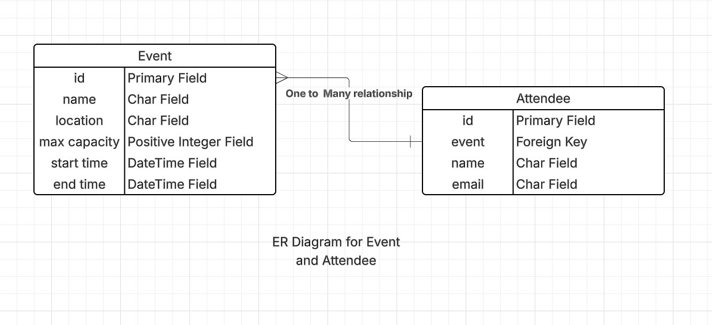

# 🎟️ Mini Event Management System API

A simple, scalable, and dockerized Django REST API that allows users to:
- Create events
- Register attendees (with duplicate and overbooking prevention)
- View registered attendees for each event
---

## 🚀 Features

- Create and list events
- Register attendees with validations
- Prevent duplicate registrations and overbooking
- View attendees per event with pagination
- Timezone-aware datetime handling
- Dockerized for easy deployment
- Standardized response on both success on errors
- Optional SQLite for testing; PostgreSQL for production

---

## 🧱 Tech Stack

- **Language**: Python
- **Backend**: Django, Django REST Framework
- **Database**: PostgreSQL (default), SQLite (for tests)
- **Docs**: Swagger/OpenAPI (via drf-spectacular or drf-yasg)
- **Containerization**: Docker, Docker Compose

---

## 🐳 Project Setup Instructions

### 1. Docker Requirements

- Make sure Docker and Docker Compose are installed.
- Install Docker
- Install Docker Compose

### 2. Clone the Repository

```bash
git clone https://github.com/your-username/event-management-api.git
cd event-management-api
```

### 3. Run the Applicatoin

```bash
docker-compose up --build
```

### 4. Run the test cases

- I have written some test cases, in order to run those test cases

```bash
docker-compose exec web
DJANGO_TESTING=true python manage.py test 
```

### ER Diagram

