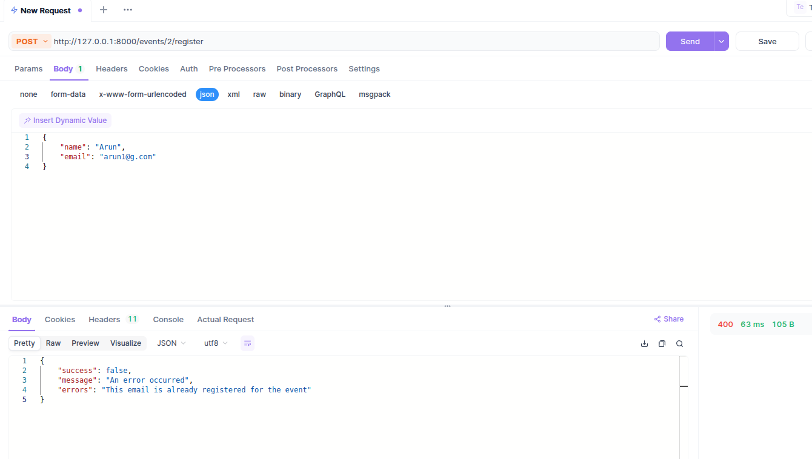

# Omnify
# 🎟️ Mini Event Management System API

A simple, scalable, and dockerized Django REST API that allows users to:
- Create events
- Register attendees (with duplicate and overbooking prevention)
- View registered attendees for each event
---

## 🚀 Features

- Create and list events
- Register attendees with validations
- Prevent duplicate registrations and overbooking
- View attendees per event with pagination
- Timezone-aware datetime handling
- Dockerized for easy deployment
- Standardized response on both success on errors
- Optional SQLite for testing; PostgreSQL for production

---

## 🧱 Tech Stack

- **Language**: Python
- **Backend**: Django, Django REST Framework
- **Database**: PostgreSQL (default), SQLite (for tests)
- **Docs**: Swagger/OpenAPI (via drf-spectacular or drf-yasg)
- **Containerization**: Docker, Docker Compose

---

## 🐳 Project Setup Instructions

### 1. Docker Requirements

- Make sure Docker and Docker Compose are installed.
- Install Docker
- Install Docker Compose

### 2. Clone the Repository

```bash
git clone https://github.com/asiftp654/omnify.git
cd omnify
```

### 3. Run the Applicatoin

- Try sudo if dont have permission to run the docker command

```bash
docker-compose build
docker-compose up
```

### 4. Test the APIS

- You can able to access all the apis in the requirements with the base url http://127.0.0.1:8000

---

### 5. Run the test cases

- I have written some test cases, in order to run those test cases

```bash
docker-compose exec web bash
DJANGO_TESTING=true python manage.py test 
```

---

### 6. To Stop the Appication

- CTRL + C in the terminal and then

```bash
docker-compose down
```

---

### ER Diagram


---

### Sample API Requests

### 1. GET /events

- List all the events


---

### 2. POST /events

- Create a Event (with added validations)
-(ex) Validations like start time must greater than end time


---

### 3. POST /events/{event_id}/register

- Register Attendees to a event
- Handled concurrency issues, email duplication issue, event not found issues.





---

### 4. GET /events/{event_id}/attendees

- List all the attendees for a event


---